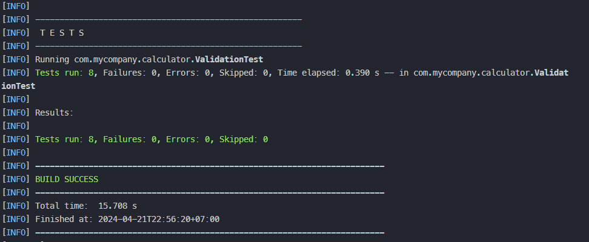

# automation-test-ppl-week-8

This is the repository for maintaining the calculator application to be used in testing phase using white-box approach. You may clone this repository at your respective folder on your laptop.

## Description
### What our application does
This calculator application is designed to perform four basic operations: addition, subtraction, multiplication, and division. It will take two operands and one operator. It is built using Java programming language and Maven as the build tool. The application is designed to be run from the command line interface (CLI) and can be used to perform the operations mentioned above.


## Installation
To clone this repository, run this command within your terminal/CLI:

```bash
git clone https://github.com/rachmatpurwasaputra/calculator-testing.git
```

To push your change, do these steps mentioned below:
> Important to tell: After you've got yourself this repository on your laptop, make sure to always run `git pull` command first whenever you want to push your change
<br/>

1. Add the file that has been changed by you using this syntax:
    ```bash
    git add <file-name-that-has-been-changed>
    ```
2. Commit the added file, with short yet meaningful message after `-m` directive:
    ```bash
    git commit -m "meaningful message about the change you have made"
    ```
3. Then, push yout commit to this repository, using this syntax:
   ```bash
   git push
   ```
   > <b>NOTE</b>: Make sure you are pushing towards the `main` branch, NOT to the `master` branch. In case yout local branch on your computer/laptop are having master branch, please change it to the main first.

The project itself using VS Code (denoted by `.vscode` folder). We encourage you to use the same editor. Start viewing and editing the code from the `/calculator` folder

To install all dependencies (make sure you are in `/calculator` folder so CLI can read `pom.xml`), run this command below:

```bash
mvn clean install
```

## Technologies
* <b>Repository Management</b>: Git
* <b>IDE & Code Editor</b>: Visual Studio Code
* <b>Build Tool</b>: Maven
* <b>Programming Language</b>: Java (JDK 17)
* <b>Unit Testing</b>: JUnit 5.7.2
* <b>Mocking</b>: Mockito 5.11.0
* <b>CLI</b>: Powershell (Windows) / CMD

## How to run Main application

To run the main application, run these commands consecutively within your terminal/CLI (make sure you are currently in `/calculator` folder) :
```bash
# move to /calculator/src/main/java directory
cd .\src\main\java

# compile all java files
javac -d ..\..\..\target\classes .\com\mycompany\calculator\*.java

# run the Main class
java -cp ..\..\..\target\classes com.mycompany.calculator.Main
```

## Structure of /calculator/src/main/java directory
Within there should be four main classes, namely:
1. `Main.java`
2. `Calculation.java`, consists of one method to calculate the result of the operation from two numbers and one operator
3. `Operator.java`, consists of four methods, each returning the result for one operation (addition, subtraction, multiplication, division)
4. `Validation.java`, consists of one method to validate the input, whether it is a valid number or not (within the permissible range), whether it is trying to do division with zero, and whether the operator is valid or not.

## How to do unit testing
Run this command within your terminal/CLI (make sure you are currently in /calculator folder) :

```bash
mvn test
```

To test individual class only (for example ValidationTest.java), run this command:
```bash
mvn test -Dtest=ValidationTest
```

This is the result of that test:<br><br/>


Run this command to generate the report using its standalone goal:

```bash
mvn surefire-report:report 
```

## Attribution
This repository is maintained by Kelompok B1 Kelas 3B DIV-Teknik Informatika Politeknik Negeri Bandung.
Anggota:
- Muhammad Rafi Farhan     (211524051)
- Rachmat Purwa Saputra    (211524054)
- Reihan Hadi Fauzan       (211524058)
